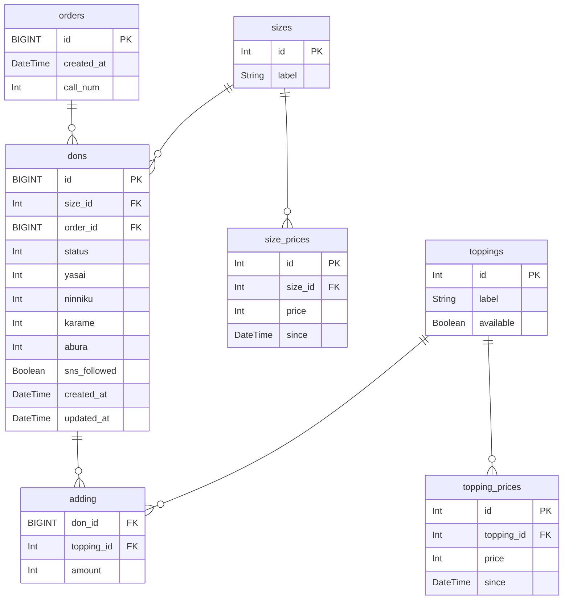

# Database Schema

```mermaid
erDiagram
    orders ||--o{ dons : ""
    sizes ||--o{ dons : ""
    sizes ||--o{ size_prices : ""
    toppings ||--o{ adding : ""
    dons ||--o{ adding : ""
    toppings ||--o{ topping_prices : ""

    orders {
        BIGINT id PK
        DateTime created_at
        Int call_num
    }
    dons {
        BIGINT id PK
        Int size_id FK
        BIGINT order_id FK
        Int status
        Int yasai
        Int ninniku
        Int karame
        Int abura
        Boolean sns_followed
        DateTime created_at
        DateTime updated_at
    }
    adding {
        BIGINT don_id FK
        Int topping_id FK
        Int amount
    }
    sizes {
        Int id PK
        String label
    }
    size_prices {
        Int id PK
        Int size_id FK
        Int price
        DateTime since
    }
    toppings {
        Int id PK
        String label
        Boolean available
    }
    topping_prices {
        Int id PK
        Int topping_id FK
        Int price
        DateTime since
    }
```
